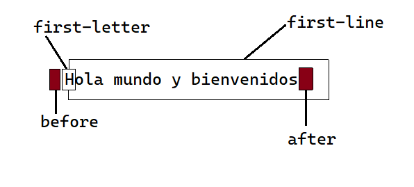

# **SELECTORES AVANZADOS**

## **Selector de hijos**

Selecciona un elemento que es **_hijo directo_** de otro elemento. Se usa con el "signo de mayor que" (>):

```css
p > a {
  color: red;
}
```

En el ejemplo anterior, el selector _p > a_ se interpreta como "cualquier elemento `<a>` que sea hijo directo de un elemento `<p>`".

## **Selector adyacente**

El selector adyacente se emplea para seleccionar elementos que en el código HTML de la página se encuentran justo a continuación de otros elementos.

Sintaxis:

```css
Elemento1 + Elemento2 {
  ...;
}
```

Con la expresión anterior seleccionamos todos los elementos de tipo **_elemento2_** cuyo elemento padre sea el mismo que el de los elementos **_elemento1_**, con la condición de que los elementos **_elemento2_** vayan inmeditamente después de los elementos **_elemento1_**.

Es decir:

- elemento1 y elemento2 deben ser elementos hermanos, por lo que su elemento padre debe ser el mismo.
- elemento2 debe aparecer inmediatamente después de elemento1 en el código HTML de la página

Ejemplo:

HTML de la página:

```html
<body>
  <h1>Título principal</h1>
  <h2>Título secundario</h2>
  ...
  <h2>Subtítulo</h2>
</body>
```

Propiedades CSS

```css
h1 + h2 {
  color: red;
}
```

Con lo anterior expuesto, el elemento padre es `<body>` tanto para `<h1>` como para `<h2>` (ambos son elementos hermanos). Ahora bien, `<h2>` va justo después de `<h1>`, por lo tanto cumple con todas la condiciones para que se apliquen las propiedades CSS.

El otro `<h2>` solo cumple una condicón, que tienen a `<body>` como elemento padre, pero no va inmediatamente después de `<h1>`.

## **Selectores de atributos**

Selecciona elementos HTML en función de sus atributos y/o valores de esos atributos.

1. `elemento[atributo]`
   ```css
   a[target] {
     color: red;
   }
   ```
   Selecciona todos los elementos con un atributo `target`, independiente de su valor.
2. `elemento[atributo="valor"]`
   ```css
   a[target='_blank'] {
     color: red;
   }
   ```
   Selecciona todos los elementos con un atributo `target` con el valor `_blank`.
3. `elemento[atributo~="valor"]`
   ```css
   a[target~='_blank'] {
     color: red;
   }
   ```
   Selecciona todos los elementos con un atributo `target` y al menos **_uno_** de los valores del atributo es `_blank`.
4. `elemento[atributo|='valor']`
   ```css
   *[lang|='es'] {
     color: red;
   }
   ```
   Selecciona todos los elementos con un atributo `lang` y cuyo valor es una serie de palabras separadas con guiones, pero comienza con `es`.

## **Pseudo-elementos**



1. `:first-line` selecciona la primera línea de texto de un elemento.

   ```css
   p:first-line {
     text-transform: uppercase;
   }
   ```

   la siguiente regla CSS muestra en mayúsculas la primera línea de cada párrafo:

2. `first-letter` selecciona la primera letra de la primera línea de texto de un elemento
   ```css
   p:first-letter {
     text-transform: uppercase;
   }
   ```
   Muestra en mayúsculas la primera letra de cada párrafo:
3. `:before` y `:after` se utilizan en combinación con la propiedad `content` de CSS para añadir contenidos **antes** o **después** del contenido original de un elemento.
   ```css 
   h1:before { content: "Capítulo - "; } 
   p:after { content: "."; } 
   ```
    Las siguientes reglas CSS añaden el texto Capítulo - delante de cada título de sección `<h1>` y el carácter "." detrás de cada párrafo de la página.

**En CSS3 Para usarlos escribimos "::" en lugar de ":".**

## **Pseudo-clases**
1. `elemento:first-child` selecciona el **primer elemento hijo** de un elemento.

    Ejemplo:

    HTML:
    ```html
    <p>Lorem <span><em>ipsum dolor</em></span> sit amet, consectetuer adipiscing elit. Praesent odio sem, tempor quis, <em>auctor eu</em>, tempus at, enim. Praesent nulla ante, <em>ultricies</em> id, porttitor ut, pulvinar quis, dui.</p>
    ```
    CSS:
   ```css
   p em:first-child {
     color: red;
   }
   ```
   El selector `p em:first-child` selecciona el primer elemento `<em>` que sea hijo de un elemento y que se encuentre dentro de un elemento `<p>`. Por tanto, en el ejemplo anterior sólo el primer `<em>` se ve de color rojo.
<!-- más adelante poner ejemplos de cada uno -->
2. `elemento:nth-child(numero)` selecciona el elemento indicado pero con la condición de que sea el hijo enésimo de su padre. Este selector es útil para seleccionar el segundo párrafo de un elemento, el quinto elemento de una lista, etc.
3. `elemento:nth-last-child(numero)`, idéntico al anterior pero el número indicado se empieza a contar desde el último hijo.
4. `elemento:empty`, selecciona el elemento indicado pero con la condición de que no tenga ningún hijo. La condición implica que tampoco puede tener ningún contenido de texto.
5. `elemento:last-child` seleccionan los elementos indicados de los últimos hijos de su elemento padre.
6. `elemento:nth-of-type(numero)`, selecciona el elemento indicado pero con la condición de que sea el enésimo elemento hermano de ese tipo.
7. `elemento:nth-last-of-type(numero)`, idéntico al anterior pero el número indicado se empieza a contar desde el último hijo.
